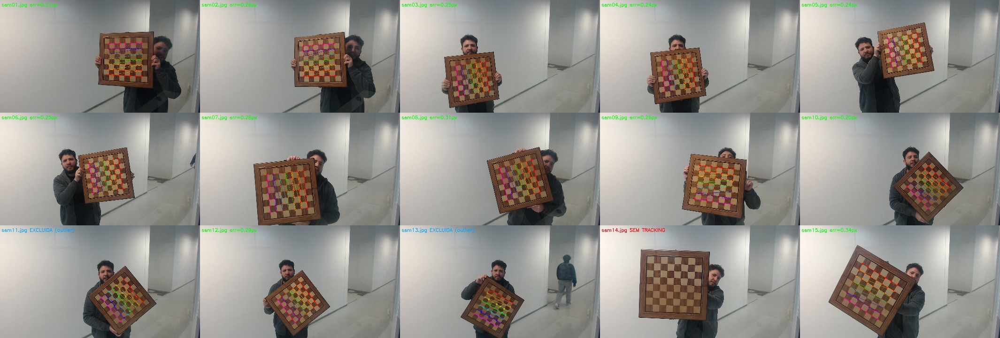
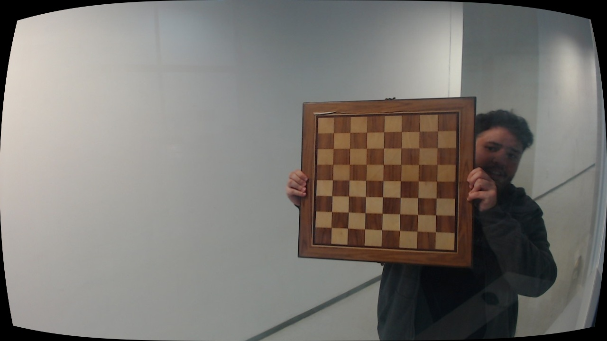
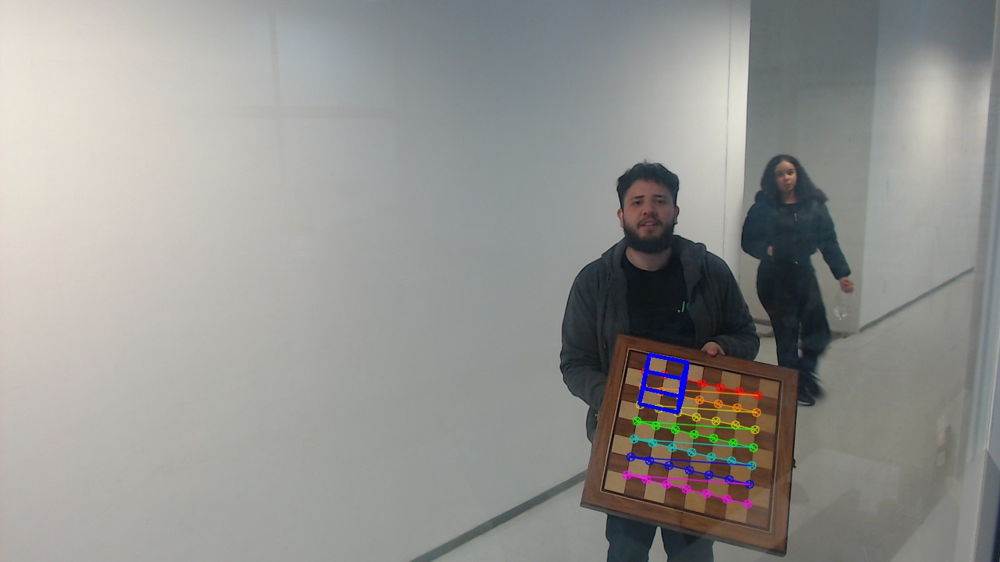

## 1. Introdução


Este relatório mostra o processo de calibração de uma câmera Logitech C920 (operando em 1280x720, MJPEG) através do método de Zhang. Como padrão de referência, utilizamos um tabuleiro quadriculado de 8x8 casas (compondo 7x7 cantos internos), com quadrados medindo 50 mm de lado. O objetivo principal do trabalho foi extrair as matrizes intrínseca e de distorção da lente, retificar as imagens capturadas e validar o modelo estimando a pose da câmera para projetar coordenadas 3D conhecidas no plano 2D da imagem.

## 2. Metodologia

A fase de aquisição de dados exigiu ajustes práticos. Inicialmente, tentamos capturar o tabuleiro utilizando uma rajada temporizada, tirando 20 fotos com intervalos de 4 segundos. Porém, essa abordagem cega resultou em um alto índice de descarte devido aos borrões de movimento e cortes do alvo na borda da imagem. Apenas 2 das 20 capturas puderam ser aproveitadas.

Para contornar esse problema na coleta, desenvolvemos um script de captura assistida (`scripts/semaforo.py`). Esse programa exibia um *preview* ao vivo do sensor e realizava uma validação em tempo real, o frame só era salvo no disco (`imgs/semaforo/`) se o algoritmo conseguisse identificar os 49 cantos de forma íntegra e se a métrica de nitidez (laplaciano) estivesse acima de um limiar pré-definido. Com isso, conseguimos capturar um conjunto robusto de 15 imagens de alta qualidade.

A etapa de calibração (`scripts/calibra.py`) foi construída em torno da função `calibrateCamera` do OpenCV, apoiada pela função `cornerSubPix` para o refino subpixel das coordenadas dos cantos. Utilizamos 12 imagens finais, descartando algumas capturas como *outliers* pois apresentavam um erro de reprojeção inicial acima de 1,5 pixel. Para validar o sistema, criamos o script `scripts/experimento_3d2d.py`, que aplica a função `solvePnP` para estimar a pose da câmera e, a partir dela, desenhar um cubo virtual de 100 mm de aresta sobre a base do tabuleiro real.

## 3. Resultados

Matriz intrínseca e distorção obtidas:

```
K = [[990,   0, 649],
     [  0, 989, 391],
     [  0,   0,   1]]
dist = [0.073, -0.714, 0.0087, 0.0037, 2.56]
```

O modelo apresentou um erro médio de reprojeção muito baixo, na ordem de **0,27 px**. Observando individualmente, as 12 fotos utilizadas mantiveram o erro contido na faixa de 0,20 a 0,34 pixels. A Figura 1 ilustra a precisão desse tracking, exibindo os cantos detectados em verde e a reprojeção em vermelho.

{ width=95% }

A remoção da distorção foi aplicada com `getOptimalNewCameraMatrix` +
`undistort` (A figura 2 evidencia o antes e depois da correção da geometria da lente).

{ width=90% }

No experimento 3D para 2D, com o tabuleiro a
t = [381, 181, 2132] mm da câmera, os 49 cantos 3D foram reprojetados
com **RMSE de 0,27 px**, e o cubo virtual de 100 mm assentou sobre o
tabuleiro (figura 3). Um GIF com o cubo rastreado em vídeo
(`imgs/cubo.gif`, 21/80 quadros com pose) está no repositório.

{ width=90% }

## 4. Conclusão

A calibração por Zhang com 12 fotos rendeu parâmetros intrínsecos bastante coerentes
(fx ~ fy, centro próximo ao meio do sensor) e erro de 0,27 px.
O desenvolvimento prático evidenciou que o maior desafio de um pipeline de calibração reside principalmente na qualidade da aquisição de dados. Implementar a triagem e validação em tempo real com o "semáforo" resolveu o problema que a rajada de fotos cega não conseguia evitasr. O experimento final de projeção 3D para 2D corroborou a confiabilidade de toda a cadeia de matrizes calculadas. A atual estrutura de código permite a calibração estéreo com duas câmeras.


## Referências

- ZHANG, Z. A flexible new technique for camera calibration. IEEE
  Transactions on Pattern Analysis and Machine Intelligence, 2000
  (`refs/zhang-2000-A_flexible_new_technique_for_camera_calibration.pdf`).
- Tutoriais de calibração do OpenCV, série 4.x
  (`refs/10-compVis-camera-calibration.pdf`).
